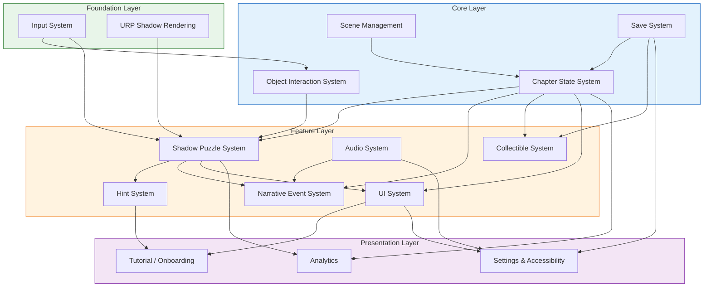

<!-- 该文件由Cursor 自动生成 -->
# Systems Index: 影子回忆 (Shadow Memory)

> **Status**: Draft
> **Created**: 2026-04-16
> **Last Updated**: 2026-04-21
> **Source Concept**: design/gdd/game-concept.md

---

## Overview

《影子回忆》是一款叙事解谜游戏，核心循环为「摆放物件 → 调整光源 → 形成影子 → 触发记忆」。玩家在温暖的室内场景中通过操控日常物件和光源，使投影在墙面上拼合出承载共同记忆的关系影子。系统设计围绕四根支柱展开：**关系即谜题**（Shadow Puzzle + Narrative 为核心驱动）、**日常即重量**（Object Interaction 的触感体验）、**克制表达**（低文本的碎片化叙事机制）、**缺席比存在更有力**（后期支持不可还原的残缺谜题）。整体系统规模精简，面向移动端优化，从 MVP 的单场景 3 谜题逐步扩展到 5 章完整体验。

---

## Systems Enumeration

| # | System Name | Category | Priority | Status | Design Doc | Depends On |
|---|-------------|----------|----------|--------|------------|------------|
| 1 | Input System | Foundation | MVP | **Draft** | `design/gdd/input-system.md` | — |
| 2 | Shadow Puzzle System | Gameplay | MVP | **Draft** | `design/gdd/shadow-puzzle-system.md` | Input System, Object Interaction System, Chapter State System, URP Shadow Rendering |
| 3 | Object Interaction System | Gameplay | MVP | **Draft** | `design/gdd/object-interaction.md` | Input System |
| 4 | Chapter State System | Progression | MVP | **Draft** | `design/gdd/chapter-state-and-save.md` | Save System |
| 5 | Hint System | Gameplay | MVP | **Draft** | `design/gdd/hint-system.md` | Shadow Puzzle System, Timer |
| 6 | Narrative Event System | Narrative | Vertical Slice | **Draft** | `design/gdd/narrative-event-system.md` | Shadow Puzzle System, Chapter State System, Audio System |
| 7 | Save System | Persistence | MVP | **Draft** | `design/gdd/chapter-state-and-save.md` | Chapter State System |
| 8 | Audio System | Audio | Vertical Slice | **Draft** | `design/gdd/audio-system.md` | — |
| 9 | UI System | UI | MVP | **Draft** | `design/gdd/ui-system.md` | Shadow Puzzle System, Chapter State System |
| 10 | URP Shadow Rendering | Foundation | MVP | **Draft** | `design/gdd/urp-shadow-rendering.md` | — |
| 11 | Scene Management | Core | MVP | **Draft** | `design/gdd/scene-management.md` | Chapter State System |
| 12 | Tutorial / Onboarding | Meta | Vertical Slice | **Draft** | `design/gdd/tutorial-onboarding.md` | Hint System, UI System, Input System, Chapter State System |
| 13 | Collectible System | Gameplay | Alpha | Not Started | — | Chapter State System, Save System, Narrative Event System |
| 14 | Settings & Accessibility | Meta | Vertical Slice | **Draft** | `design/gdd/settings-accessibility.md` | Save System, UI System, Audio System |
| 15 | Analytics | Meta | Alpha | Not Started | — | Shadow Puzzle System, Chapter State System |

---

## Categories

| Category | Description | 本项目中的系统 |
|----------|-------------|---------------|
| **Core** | 所有系统赖以运行的基础设施 | Input System, URP Shadow Rendering, Scene Management |
| **Gameplay** | 构成核心玩法循环的系统 | Shadow Puzzle System, Object Interaction System, Hint System, Collectible System |
| **Progression** | 控制玩家推进节奏的系统 | Chapter State System |
| **Persistence** | 存档与状态持久化 | Save System |
| **UI** | 面向玩家的信息展示 | UI System |
| **Audio** | 声音与音乐管理 | Audio System |
| **Narrative** | 故事与演出驱动 | Narrative Event System |
| **Meta** | 核心循环外的辅助系统 | Tutorial / Onboarding, Settings & Accessibility, Analytics |

---

## Priority Tiers

| Tier | Definition | Target Milestone | 本项目里程碑 | Design Urgency |
|------|------------|------------------|-------------|----------------|
| **MVP** | 核心循环运转所需：能在单场景中拖拽物件 → 匹配影子 → 看到成功反馈 | First playable | 4-6 周 | Design FIRST |
| **Vertical Slice** | 一个完整章节的打磨体验：叙事演出、音频包裹、引导教程 | Vertical slice | 8-12 周 | Design SECOND |
| **Alpha** | 全部功能到位（5 章内容占位、收集品、数据分析） | Alpha | 20-28 周 | Design THIRD |
| **Full Vision** | 全量内容、缺席型谜题打磨、辅助功能、跨平台适配 | Beta / Release | 32-40 周 | Design as needed |

---

## Dependency Map

### Foundation Layer（无依赖）

1. **Input System** — 触屏输入抽象层，封装拖拽/旋转/点击手势，所有交互系统的入口
2. **URP Shadow Rendering** — 基于 URP 的实时影子投影与匹配检测渲染管线，Shadow Puzzle 的视觉基础

### Core Layer（依赖 Foundation）

1. **Scene Management** — 依赖: Chapter State System | 管理场景加载/卸载/切换，章节与场景的映射关系
2. **Object Interaction System** — 依赖: Input System | 物件选中、拖拽、旋转、格点吸附的物理交互层
3. **Chapter State System** — 依赖: Save System | 章节解锁/推进/谜题排序的状态管理，全局进度的唯一来源
4. **Save System** — 依赖: Chapter State System（双向）| 谜题完成状态、章节进度、收集物的持久化存储

### Feature Layer（依赖 Core）

1. **Shadow Puzzle System** — 依赖: Input System, Object Interaction, Chapter State, URP Shadow Rendering | 核心玩法：物件摆放 + 光源操控 + 影子匹配判定
2. **Hint System** — 依赖: Shadow Puzzle System, TimerModule | 三层渐进提示，基于匹配度和玩家行为数据触发
3. **Narrative Event System** — 依赖: Shadow Puzzle System, Chapter State System, Audio System | 接收谜题/章节完成事件，驱动记忆重现演出
4. **Audio System** — 无强依赖（独立基础设施）| 环境音、情绪音效、章节氛围音乐、匹配反馈音
5. **UI System** — 依赖: Shadow Puzzle System, Chapter State System | 操作提示、章节进度、暂停菜单、提示按钮
6. **Collectible System** — 依赖: Chapter State System, Save System, Narrative Event System | 隐藏照片/物件/声音片段，补充叙事细节

### Presentation Layer（依赖 Feature）

1. **Tutorial / Onboarding** — 依赖: Hint System, UI System | 首次游玩引导，渐进式教学操作方式
2. **Settings & Accessibility** — 依赖: Save System, UI System, Audio System | 音量/灵敏度/辅助功能设置
3. **Analytics** — 依赖: Shadow Puzzle System, Chapter State System | 谜题耗时、提示使用率、章节完成率等数据采集

---

## Recommended Design Order

| Order | System | Priority | Layer | Est. Effort | Rationale |
|-------|--------|----------|-------|-------------|-----------|
| 1 | Input System | MVP | Foundation | S | 定义触屏交互协议，所有上层系统等待此接口 |
| 2 | URP Shadow Rendering | MVP | Foundation | L | 技术风险最高，需要早期原型验证移动端性能 |
| 3 | Object Interaction System | MVP | Core | M | Shadow Puzzle 的手感核心，与 Input System 紧耦合 |
| 4 | Shadow Puzzle System | MVP | Feature | L | 核心玩法，GDD 已有初稿，需继续细化实现 |
| 5 | Chapter State System | MVP | Core | M | 谜题排序与解锁逻辑，Save System 的数据来源 |
| 6 | Save System | MVP | Core | S | 断点续玩，数据结构简单但必须早期定义 |
| 7 | Hint System | MVP | Feature | M | 防卡关机制，与 Shadow Puzzle 紧密协作 |
| 8 | UI System | MVP | Feature | M | MVP 所需的操作提示和基础界面 |
| 9 | Scene Management | MVP | Core | S | TEngine 已提供基础能力，封装章节场景映射即可 |
| 10 | Audio System | Vertical Slice | Feature | M | 情绪包裹的核心载体，TEngine AudioModule 可加速开发 |
| 11 | Narrative Event System | Vertical Slice | Feature | L | 需要 Shadow Puzzle 和 Audio 就绪后才能调试演出效果 |
| 12 | Tutorial / Onboarding | Vertical Slice | Presentation | S | 基于 Hint System 扩展，首次游玩专用 |
| 13 | Settings & Accessibility | Vertical Slice | Presentation | S | 标准功能，低设计风险 |
| 14 | Collectible System | Alpha | Feature | M | 非核心循环，但丰富叙事层次 |
| 15 | Analytics | Alpha | Presentation | S | 调优所需的数据采集，不影响游戏体验 |

> **Effort**: S = 1 session, M = 2-3 sessions, L = 4+ sessions

---

## Circular Dependencies

- **Chapter State System ↔ Save System**: Chapter State 需要 Save System 读取持久化进度；Save System 需要 Chapter State 提供要存储的数据。**解决方案**: Chapter State 作为运行时数据所有者，定义 `IChapterProgress` 数据接口；Save System 仅负责序列化/反序列化该接口数据，不直接引用 Chapter State 的内部状态。启动时 Save System 先加载数据，再注入 Chapter State 初始化。
- **Shadow Puzzle System ↔ Hint System（弱循环）**: Puzzle 向 Hint 输出匹配度数据，Hint 向 Puzzle 请求物件状态用于生成引导。**解决方案**: Hint System 通过只读查询接口访问 Puzzle 状态，不反向写入。两者通过 GameEvent 解耦，不形成强编译依赖。

---

## High-Risk Systems

| System | Risk Type | Risk Description | Mitigation |
|--------|-----------|-----------------|------------|
| URP Shadow Rendering | Technical | 移动端（尤其低端 Android）实时影子性能存疑；投影纹理 vs 实时阴影方案未定 | **立即原型**：在 iPhone 13 Mini + 低端 Android 上验证两种方案的帧率和视觉质量，MVP 前决策 |
| Shadow Puzzle System — 匹配算法 | Design / Technical | 多锚点加权评分的公式是否在各种物件组合下都能给出直觉一致的结果尚未验证 | 用 3 个 MVP 谜题快速迭代匹配公式，建立自动化测试用例验证阈值 |
| Object Interaction — 移动端手感 | Design | 触屏拖拽+旋转+格点吸附在小屏幕上的手感能否达到 Unpacking 级别存疑 | 独立构建交互原型，在真机上进行 5 人以上的手感测试 |
| Narrative Event System — 演出制作 | Scope | "记忆重现演出"（场景变化、色温、环境音联动）的制作成本可能被低估 | 将演出拆为可组合的原子效果（色温变化/物件动画/音频切换），通过配置表驱动编排，避免每个谜题手工制作 |
| 第五章"缺席型谜题" | Design | "不可完整还原"的残缺谜题是否会被玩家误解为 bug 而非设计意图 | Vertical Slice 阶段制作 1 个缺席型谜题原型，进行玩家测试验证理解率 |

---

## TEngine Integration Map

> 本项目基于 TEngine 6.0.0 框架，以下映射各系统到 TEngine 模块和基础设施。

| Game System | TEngine Module / Facility | Integration Notes |
|-------------|--------------------------|-------------------|
| Input System | Unity InputSystem + 自定义手势封装 | TEngine 不提供输入封装，需自建 |
| Shadow Puzzle System | FsmModule (状态机) + GameEvent (事件) | 谜题状态机用 FsmModule 驱动，完成事件通过 GameEvent 广播 |
| Object Interaction | 自定义 + UniTask | 拖拽/旋转逻辑自建，异步操作用 UniTask |
| Chapter State System | GameEvent + Luban (配置表) | 章节配置走 Luban，状态变更通过 GameEvent 通知 |
| Hint System | TimerModule + GameEvent | 停留计时用 TimerModule，触发条件通过 GameEvent 监听 |
| Narrative Event System | GameEvent + AudioModule + FsmModule | 事件驱动 + 演出状态机 + 音频切换 |
| Save System | 自定义（JSON/Binary） | TEngine 无内置存档模块，需自建 |
| Audio System | AudioModule | 直接使用 TEngine AudioModule，扩展情绪包裹逻辑 |
| UI System | UIModule (UIWindow / UIWidget) | 所有游戏 UI 通过 UIModule 管理 |
| Scene Management | ResourceModule + SceneModule | 场景加载/卸载通过 TEngine 资源管线 |
| Collectible System | GameEvent + Save System + Luban | 收集物定义走配置表，状态通过 Save System 持久化 |
| Settings | UIModule + Save System | 设置界面用 UIModule，偏好存本地 |

---

## Progress Tracker

| Metric | Count |
|--------|-------|
| Total systems identified | 15 |
| Design docs started | **13** (9 MVP + 4 VS) |
| Design docs reviewed | 0 |
| Design docs approved | 0 |
| MVP systems designed | **9/9** ✅ |
| Vertical Slice systems designed | **4/4** ✅ |
| Alpha systems designed | 0/2 |

---

## Next Steps

- [x] Design MVP-tier systems: 全部 9 个 MVP 系统 GDD 已完成初稿
- [ ] **Review all MVP GDDs** — 逐系统审查设计一致性和可行性
- [ ] **URP Shadow Rendering 原型**（技术风险最高，需立即启动性能验证）
- [ ] 在 3 个 MVP 谜题上验证匹配公式和手感
- [ ] 建立 Object Interaction 的真机手感测试流程
- [x] Design Vertical Slice systems: Narrative Event → Audio → Tutorial → Settings (全部初稿完成)
- [ ] **Review all Vertical Slice GDDs** — 审查 4 份 VS GDD 一致性和可行性
- [ ] Run `/gate-check pre-production` when MVP systems are reviewed & approved
